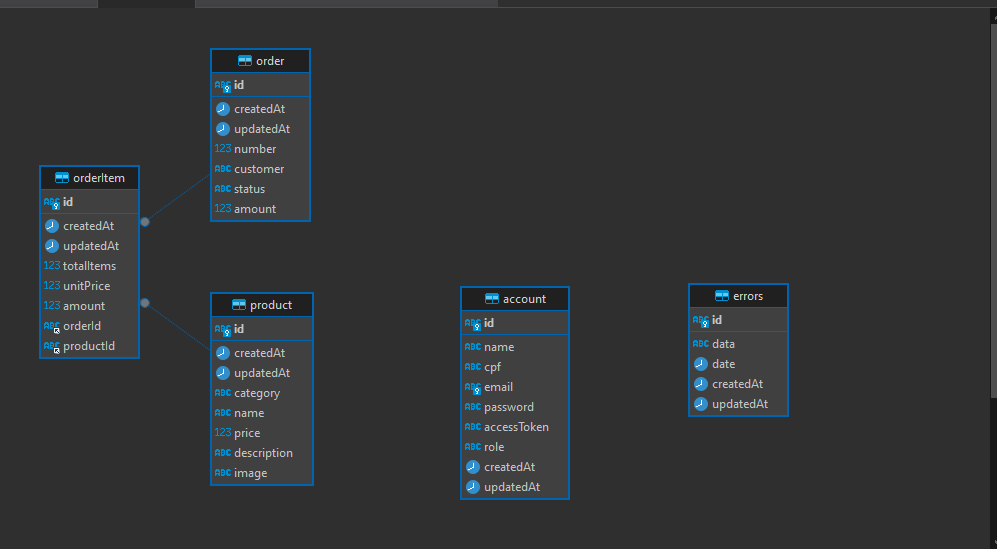

### Migração do MongoDB em EKS para MySQL no RDS para a API

Esta seção documenta a migração da tecnologia de armazenamento de dados da API. A mudança substitui o paradigma NoSQL, utilizando MongoDB hospedado em um cluster EKS, por um modelo relacional com MySQL no Amazon RDS.

#### Motivação

Embora o EKS seja uma tecnologia poderosa para desenvolvimento de aplicações em nuvem, ele apresenta desvantagens para a gestão de dados, tais como:

* Complexidade na gestão: Requer conhecimento especializado em Kubernetes para orquestração, segurança e replicação de instâncias, demandando mais tempo e expertise da equipe.
* Custos potencialmente elevados: A falta de dimensionamento preciso, especialmente em momentos de pico de demanda, pode gerar custos significativos para a aplicação.
* Alta demanda por configurações manuais: Garantir a tolerância a falhas exige configurações manuais complexas, aumentando a carga de trabalho da equipe.

A migração para um banco de dados hospedado no RDS oferece diversas vantagens. O serviço abstrai a gestão de infraestrutura, backups, replicação, monitoramento e ajuste de performance. Além disso, permite a implementação de instâncias otimizadas para diferentes cargas de trabalho, simplificando o gerenciamento e otimizando o desempenho.

#### Escolha do MySQL

O MySQL destaca-se como uma das tecnologias de banco de dados mais populares e maduras do mercado, contando com ampla comunidade colaborativa e suporte técnico. Sua performance em workloads intensivos de leitura o torna uma escolha natural para aplicações web com alta demanda.
A sintaxe simples e intuitiva do MySQL contribui para uma curva de aprendizado rápida, reduzindo a necessidade de treinamentos especializados para a equipe.

#### Design e Projeto do Banco

O banco de dados fiap-api foi projetado para armazenar e gerenciar informações relacionadas a um sistema de pedidos. Sua estrutura, definida pelo script SQL apresentado, demonstra atenção à organização, performance e segurança dos dados.

O banco de dados é composto por sete entidades principais: account, product, order, orderdet, payment e paymentdet.

  

* account: armazena informações sobre os clientes, como nome, CGC, email e senha (criptografada).

name:
Tipo: varchar(191)
Descrição: Nome completo do usuário.
Restrições: Não pode ser nulo.
cpf:
Tipo: varchar(191)
Descrição: CPF (Cadastro de Pessoa Física) do usuário.
Restrições: Não pode ser nulo.
email:
Tipo: varchar(191)
Descrição: Endereço de email do usuário.
Restrições: Não pode ser nulo. Deve ser único na tabela (chave única account_email_key).
password:
Tipo: varchar(191)
Descrição: Senha do usuário (armazenada de forma segura, idealmente com hash e salt).
Restrições: Não pode ser nulo.
accessToken:
Tipo: varchar(191)
Descrição: Token de acesso usado para autenticar o usuário na API.
Restrições: Pode ser nulo.
role:
Tipo: varchar(191)
Descrição: Papel/permissão do usuário na aplicação (ex: "admin", "user", "editor").
Restrições: Pode ser nulo.

* product: contém detalhes sobre os produtos, incluindo nome e preço unitário.

category:
Tipo: varchar(191)
Descrição: Categoria do produto (ex: "Eletrônicos", "Roupas", "Livros").
Restrições: Não pode ser nulo.
name:
Tipo: varchar(191)
Descrição: Nome do produto.
Restrições: Não pode ser nulo.
price:
Tipo: int(11)
Descrição: Preço do produto, em centavos (ex: 1999 para R$ 19,99).
Restrições: Não pode ser nulo.
description:
Tipo: varchar(191)
Descrição: Descrição detalhada do produto.
Restrições: Não pode ser nulo.
image:
Tipo: varchar(191)
Descrição: URL ou caminho para a imagem do produto.
Restrições: Não pode ser nulo.

* order: registra os pedidos realizados, incluindo status, data de criação, cliente associado, valor total, data de fechamento e status de pagamento.

category:
Tipo: varchar(191)
Descrição: Categoria do produto (ex: "Eletrônicos", "Roupas", "Livros").
Restrições: Não pode ser nulo.
name:
Tipo: varchar(191)
Descrição: Nome do produto.
Restrições: Não pode ser nulo.
price:
Tipo: int(11)
Descrição: Preço do produto, em centavos (ex: 1999 para R$ 19,99).
Restrições: Não pode ser nulo.
description:
Tipo: varchar(191)
Descrição: Descrição detalhada do produto.
Restrições: Não pode ser nulo.
image:
Tipo: varchar(191)
Descrição: URL ou caminho para a imagem do produto.
Restrições: Não pode ser nulo.

* orderdet: detalhes dos itens de cada pedido, relacionando produtos e quantidades.
<<<<<<< HEAD

number:
Tipo: int(11)
Descrição: Número de identificação do pedido.
Restrições: Pode ser nulo, o que sugere que a numeração do pedido pode ser gerada ou atribuída posteriormente.
customer:
Tipo: varchar(191)
Descrição: Identificador do cliente que realizou o pedido. Assumindo a estrutura do banco, provavelmente referencia o id da tabela account.
Restrições: Não pode ser nulo.
status:
Tipo: varchar(191)
Descrição: Status atual do pedido (ex: "Pendente", "Processando", "Enviado", "Entregue", "Cancelado").
Restrições: Não pode ser nulo.
amount:
Tipo: int(11)
Descrição: Valor total do pedido, em centavos (ex: 2999 para R$ 29,99).
Restrições: Não pode ser nulo.

* erros: informações de erros da aplicação.
=======
* payment: informações sobre os pagamentos, como data, desconto total, valor bruto, valor líquido e pedido associado.
* paymentdet: detalha cada pagamento, incluindo sinal, tipo, método de pagamento e valor.
>>>>>>> main
